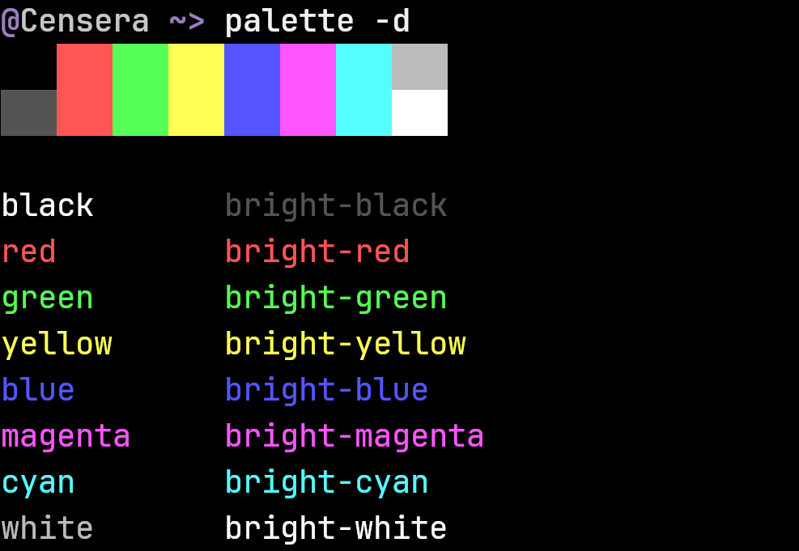
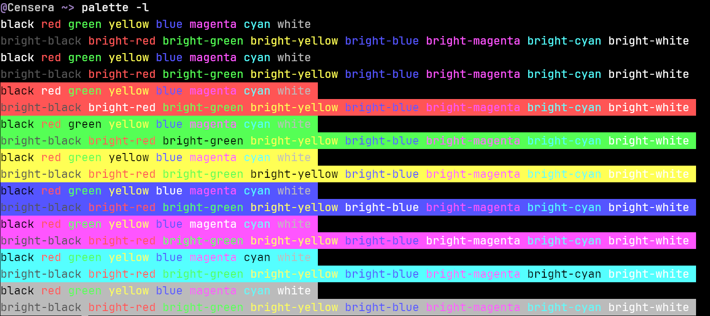
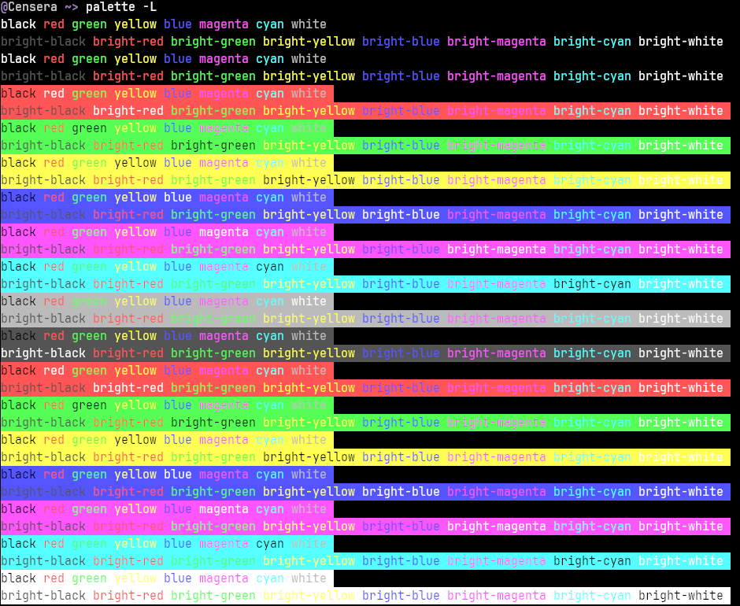

# palette
Print colors to the terminal

## Get the standard + bright colors (Swatch)

## Get detailed version

## Get long version with different BG 

## Get Longer version with bright BG colors

## Get an RGB color

